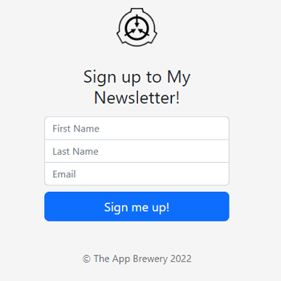

# London App Brewery - Newsletter Signup

This is a solution to the [Newsletter Signup](https://www.udemy.com/course/the-complete-web-development-bootcamp/learn/lecture/18125199) challenge on [Udemy](https://www.udemy.com/course/the-complete-web-development-bootcamp/).

## Table of contents

- [Overview](#overview)
  - [The challenge](#the-challenge)
  - [Screenshot](#screenshot)
  - [Links](#links)
- [My process](#my-process)
  - [Built with](#built-with)
  - [How to install and run](#how-to-install-and-run)
- [Author](#author)

## Overview

### The challenge

"In this lesson, we will be learning best practices when it comes to working with external APIs."

### Screenshot



### Links

- Code URL: [Github](https://github.com/cekstedt/LAB-Newsletter-Signup)
- Live Site URL: [Render](https://newsletter-signup-6vkl.onrender.com/)
- Challenge URL: [Udemy](https://www.udemy.com/course/the-complete-web-development-bootcamp/learn/lecture/18125199)

## My process

### Built with

- NodeJS
- Express
- Bootstrap

### How to install and run

#### Step one: Set up Mailchimp.com account

You will first need to sign up for a free account at mailchimp.com.   
Once you have signed up and set up an "audience" for your mailing list, get your API key and your audience's "list id" and enter them into your `.env` file like so:
```
API_KEY={api-key-string}
LIST_ID={audience-list-id}
HTTPS_PROXY={only-necessary-if-behind-a-proxy}
PORT=3000
```

#### Step two: Local installation

Make sure you have node.js installed.
```
node -v
```

Clone into the repo.
```
git clone https://github.com/cekstedt/LAB-Newsletter-Signup.git
```

Navigate into the root project folder and install dependencies.
```
cd LAB-Newsletter-Signup/
npm install
```

Run the command `npm run start` to start the server, then navigate to http://localhost:3000/ (when developing locally).


## Author

- [@cekstedt](https://github.com/cekstedt)